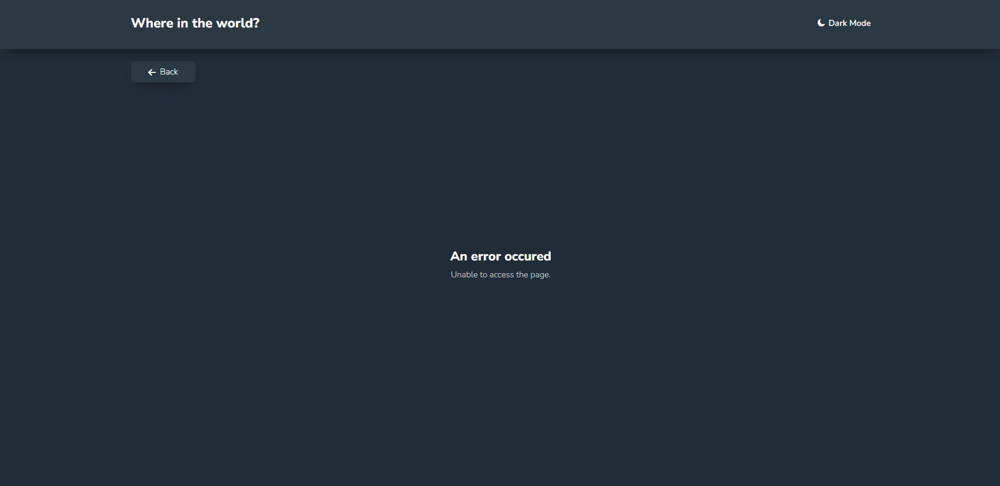

# Frontend Mentor - REST Countries API with color theme switcher solution

This is a solution to the [REST Countries API with color theme switcher challenge on Frontend Mentor](https://www.frontendmentor.io/challenges/rest-countries-api-with-color-theme-switcher-5cacc469fec04111f7b848ca). Frontend Mentor challenges help you improve your coding skills by building realistic projects.

## Table of contents

- [Overview](#overview)
  - [The challenge](#the-challenge)
  - [Screenshot](#screenshot)
  - [Built with](#built-with)
  - [What I learned](#what-i-learned)
- [Author](#author)

**Note: Delete this note and update the table of contents based on what sections you keep.**

## Overview

This project was mainly about fetching and extracting data from REST API and then converting it to a list of countries. The list can be filtered in two ways: by the country name and the region where it is located. The filtering can be performed simultaneously. Once a user click on one of the countries, they will be forwarded to another page which shows more detailed information. If a country has border coutries, a list of them will be rendered at the end of the information section and the user also can click on them to be forwarded to that country details page.

The user can switch between two themes: light and dark, by clicking on the theme button on the top right corner of the page.

While the data is being fetched, a fallback loading UI is rendered to show the user that something is happeing behind the scenes.

There is also an error page which content is depended on the type of the error. If the data has failed to be fetched, a new Response is thrown and it contains an error code of status 500. If this status is present, the provided feedback will say that retrieving the data was not successful. However, if the user tries to enter a path that does not exist, the error will say that it was unable to access the page and the user can go back to the homepage.

This project was built with React.js, React Router and Redux Toolkit. The data is fetched from REST API (https://restcountries.com/). Other concepts that were used while building this project were Responsive Web Design and Mobile-First Workflow as well as semantic and accessible markup.

### The challenge

Basic functionalities:

- displaying all countries fetched from the API on the main page
- searching for a country using by entering a country name in the input field
- filtering countries by region using the dropdown list
- clicking on a country will forward the user to a separate page which contains more detailed information about the country
- the user can click through the border countries (if they are present) on the country details page

Additional functionalities:

- toggling the color scheme between light and dark
- loading page - I have used setTimeout to slow down receiving data from the loader() function in order to show a loading page component in the UI
- error page - will be displayed if user tries to access an invalid path or if the data has failed to be fetched, feedback provided on the error page is different in those two cases
- if a country does not have any border countries, this segment simply will not be rendered

### Screenshot

Homepage light mode screenshot:

Homepage dark mode screenshot:

Country details page light mode:

Country details page dark mode:

Error page light mode:

Error page dark mode:

### Built with

- semantic HTML 5 markup
- CSS modules
- JavaScript
- React.js
- React Redux Toolkit
- React Router
- REST API
- Mobile-first workflow
- RWD

### What I learned

I've picked up this project to revise some major concepts of Redux, React Router and REST API. It was also a great project to practice filtering and sorting items that are being rendred on the page.

## Author

- GitHub - [@jsabram](https://github.com/jsabram)
- Frontend Mentor - [@jsabram](https://www.frontendmentor.io/profile/jsabram)
